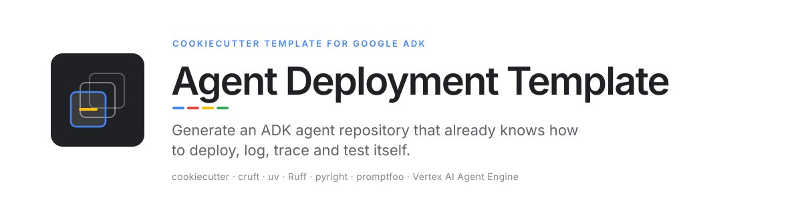
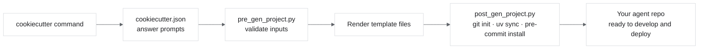
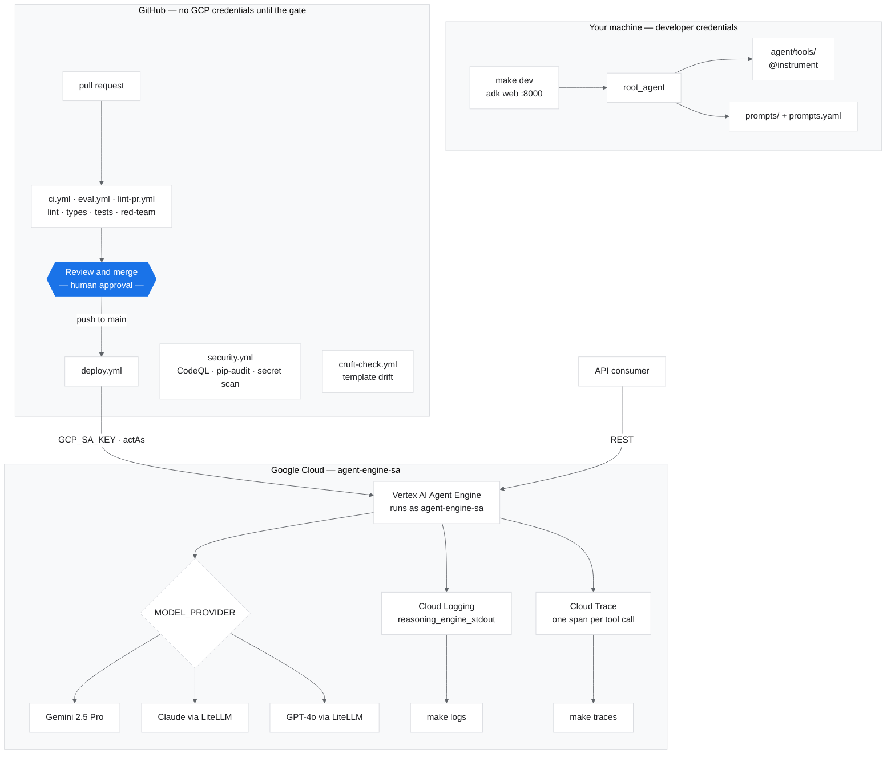

<picture>
  <source media="(prefers-color-scheme: dark)" srcset="docs/assets/banner-dark.svg">
  
</picture>

[](https://github.com/danielvogler/agent-deployment-template/actions/workflows/ci.yml)
[](https://github.com/danielvogler/agent-deployment-template/actions/workflows/validate-template.yml)
[](LICENSE)
[](pyproject.toml)
[](https://docs.astral.sh/uv/)
[](https://docs.astral.sh/ruff/)
[](https://microsoft.github.io/pyright/)
[](.pre-commit-config.yaml)
[](https://github.com/Yelp/detect-secrets)
[](https://cruft.github.io/cruft/)

---

**Answer eleven questions and get an agent repository that already knows how to deploy
itself, run as its own service account, and show you what it did afterwards.**

## Start here

Generate a project, then point your coding agent at **[AGENTS.md](./AGENTS.md)** in the
repository it just made, and tell it what you want the agent to do.

```text
Read AGENTS.md and get this deployed to our dev project. I want an agent
that can answer questions about our internal runbooks.
```

That file is written for exactly this. It covers the prerequisites worth checking before
anything is provisioned, the two credential stores a local deploy needs, the one IAM grant
that fails only after the agent has been uploaded, and how to tell whether the thing
actually works once it is running.

The rest of this page is what the agent is working from.

---

## What you get

Running `cookiecutter` against this template generates a fully configured Python repository with:

- Google ADK `root_agent` that runs out of the box with `make dev`
- Structured prompt system — compose prompts from `.md` files via a YAML registry
- Multi-provider model support: Gemini, Claude (via LiteLLM), GPT-4o (via LiteLLM)
- One-command deploy to Vertex AI Agent Engine (`make deploy-prod`)
- GitHub Actions: CI, security audit, prompt red-team eval, and deployment
- Pre-commit hooks: ruff, pyright, detect-secrets, markdownlint, commitizen
- Promptfoo red-team evaluation suite (prompt injection, jailbreak, PII tests)
- Cloud Logging and Cloud Trace integration via `make logs` / `make traces`
- `AGENTS.md` with full contributor and AI assistant instructions (`CLAUDE.md` points at it)
- `.claude/commands/` slash commands: `/deploy`, `/eval`, `/logs`

## Prerequisites

- Python 3.11+
- [uv](https://docs.astral.sh/uv/) — `curl -LsSf https://astral.sh/uv/install.sh | sh`
- Node.js 22+ (promptfoo requires it)
- [gcloud CLI](https://cloud.google.com/sdk/docs/install) (for deployment)
- [cruft](https://cruft.github.io/cruft/) — `pip install cruft` (wraps cookiecutter and tracks
  the template version so you can pull in updates later; plain
  `pip install cookiecutter` also works if you don't need update tracking)

## Quickstart

```bash
# 1. Generate your agent project (cruft is the canonical way — it records
#    which template commit you generated from, in .cruft.json)
cruft create gh:your-org/agent-deployment-template

# 2. Enter the generated project
cd your-agent-name

# 3. Configure environment
cp .env.example .env
# Edit .env — fill in GOOGLE_CLOUD_PROJECT and GOOGLE_API_KEY at minimum

# 4. Run locally
make dev   # → http://localhost:8000
```

### Keeping a generated project in sync with the template

Every generated project has a `.cruft.json` pinning the template commit it was
created from. When the template gains new features or fixes, pull them into
your project:

```bash
cruft check    # is this project behind the template?
cruft update   # apply the diff — resolve conflicts like a merge
```

## Generation flow



## Generated repo architecture



The blue node is the only point a human approves: everything upstream of it runs without
GCP credentials, and everything downstream runs as `agent-engine-sa`.

## Cookiecutter variables

| Variable | Default | Description |
| --- | --- | --- |
| `project_name` | `My ADK Agent` | Human-readable project name |
| `project_slug` | auto from name | Directory name and Python package name |
| `project_description` | — | One-line description |
| `author_name` | — | Your name |
| `author_email` | — | Your email |
| `github_org` | `your-org` | GitHub organisation |
| `gcp_project_id` | `my-gcp-project` | GCP project ID (update in `.env`) |
| `gcp_location` | `europe-west1` | Vertex AI region |
| `model_provider` | `google` | Default model provider |
| `python_version` | `3.11` | Python version |
| `open_source_license` | `MIT` | License type (`MIT`, `Apache-2.0`, `Proprietary`) |

## Contributing to the template

See [AGENTS.md](AGENTS.md) for contributor instructions (also read automatically by AI assistants).

```bash
make install    # install template dev dependencies
make validate   # generate test project and run its tests
make pre-commit # run all hooks
```
